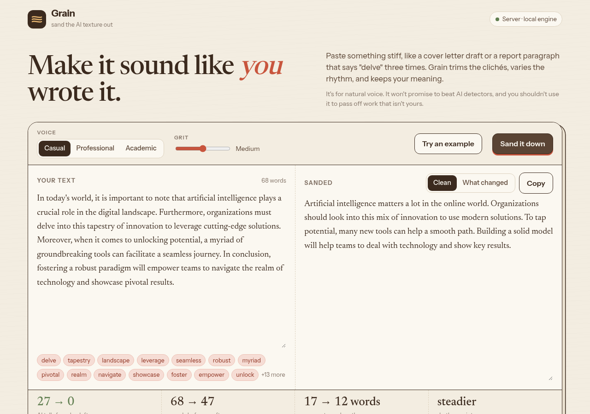
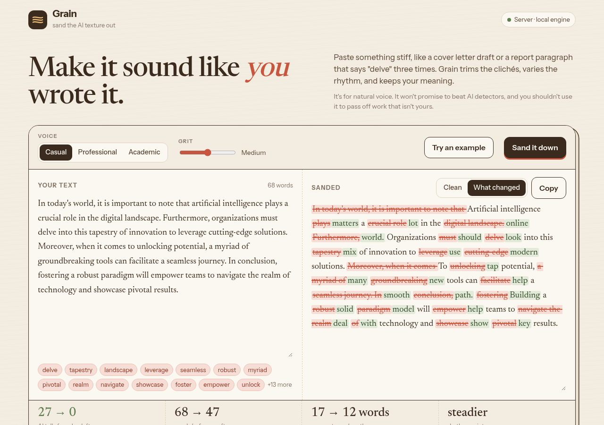

# Grain

**Grain sands the AI texture out of your writing.** Paste something stiff, like a cover letter draft, a report paragraph, or a LinkedIn post that says "delve" three times. Grain trims the clichés, varies the sentence rhythm, and keeps your meaning.

I built it because a lot of my own first drafts (and plenty of what I review) come out sounding the same: "in today's fast-paced digital landscape…". Grain is for people who want their writing to sound like *them*. It runs a free, local rule-based engine by default, and can optionally use any OpenAI-compatible LLM.

It does **not** promise to make text "undetectable", and it isn't meant for passing off work that isn't yours.

**Try it in your browser:** https://dave-4u.github.io/grain-humanizer/ (the same Python engine runs locally in your browser via Pyodide, so nothing is uploaded)



**"What changed" view.** Every removed cliché is struck through and every replacement is highlighted:



## Quickstart

```bash
./start.sh            # first run creates .venv and installs pinned deps; then http://localhost:8000
./start.sh test       # 6 tests: engine + API
```

Manual:

```bash
python3 -m venv .venv && source .venv/bin/activate     # Windows: .venv\Scripts\activate
pip install -r requirements.txt
uvicorn main:app --port 8000
```

### Optional LLM mode

Copy `.env.example` and export the variables (or set them on your host). If `OPENAI_API_KEY` is set, Grain tries the LLM first and falls back to the local engine on any error.

```bash
export OPENAI_API_KEY=...            # any OpenAI-compatible endpoint
export OPENAI_BASE_URL=https://api.openai.com/v1
export OPENAI_MODEL=gpt-4o-mini
```

## Features

- **Three voices** (Casual, Professional, Academic) and **three grit levels**
- **AI-tell spotter.** As you type, it flags phrases like *delve, tapestry, leverage, seamless, in conclusion*.
- **Before/after meter:** tells found → left, word count, average sentence length, and rhythm variety
- **What changed** diff view (`Alt+D`), one-click copy (`Ctrl+Shift+C`), and `Ctrl+Enter` to run
- **Works anywhere.** It uses the FastAPI server when one is running, and falls back to an in-browser Python engine (Pyodide) on static hosting like GitHub Pages.
- Honest about limits: tips on reading it aloud, keeping facts, and adding one real detail

### API

```bash
curl -s localhost:8000/api/humanize -H 'Content-Type: application/json' \
  -d '{"text":"It is important to note that AI plays a crucial role.","mode":"casual","strength":2}'
# → {"output": "...", "changes": ["Cleared 2 AI-pattern phrase(s)", ...]}
```

| Field | Values |
|---|---|
| `mode` | `casual` (default), `professional`, `academic-light` |
| `strength` | `1` light · `2` medium · `3` heavy |

`GET /health` returns `{"status":"ok","llm":false}`.

## Deploy

The app binds `0.0.0.0` and reads `$PORT`, so it runs as-is on Railway, Render, Fly, or a VPS (`Procfile` and `Dockerfile` included).

```bash
docker build -t grain . && docker run -p 8000:8000 -e PORT=8000 grain
```

To refresh the static Pages demo after changing the UI or engine: `sh scripts/build_pages.sh`.

## Tech stack

Python 3.10+, FastAPI, Uvicorn, and Pydantic, with a regex/heuristic multi-pass engine (`engine.py`). The UI is a single HTML file using vanilla JS (Instrument Sans + Newsreader). Pyodide powers the static demo.

```
main.py            FastAPI app (/, /health, /api/humanize)
engine.py          local rewrite pipeline + optional LLM
static/index.html  the UI
docs/              GitHub Pages demo (UI + engine.py for Pyodide)
tests/             unittest: engine + API
```

## Roadmap

- Highlight AI tells inline in the input box
- "Keep these words" list (names, product terms)
- Browser extension for Gmail / LinkedIn text boxes
- Side-by-side comparison of local engine vs LLM output

## Limitations

The local engine is rule-based. It's strong on common AI-isms and rhythm, but it isn't a full paraphrasing model. Always skim the output.

## License

MIT © Adegboro David Oluwadamilare
